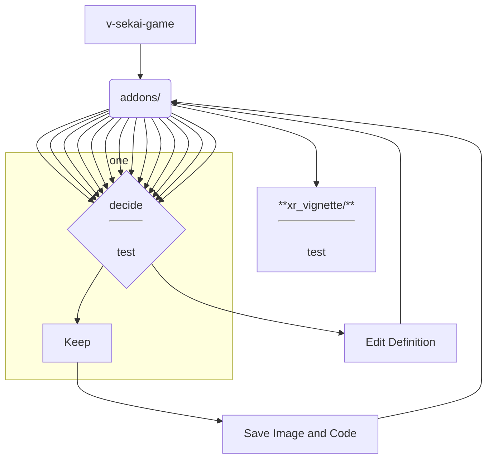
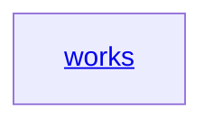

```mermaid
flowchart TD
    A[v-sekai-game] --> B(addons/)
    B --> addon1[**xr_vignette/**<hr></br>test]
    B --> C{decide<hr></br>test}
    B --> C{decide<hr></br>test}
    B --> C{decide<hr></br>test}
    B --> C{decide<hr></br>test}
    B --> C{decide<hr></br>test}
    B --> C{decide<hr></br>test}
    B --> C{decide<hr></br>test}
    B --> C{decide<hr></br>test}
    B --> C{decide<hr></br>test}
    B --> C{decide<hr></br>test}
    B --> C{decide<hr></br>test}
    B --> C{decide<hr></br>test}
    B --> C{decide<hr></br>test}
    B --> C{decide<hr></br>test}
    subgraph one
        C --> D[Keep]
    end
    C --> E[Edit Definition]
    E --> B
    D --> F[Save Image and Code]
    F --> B


```

```mermaid
flowchart TB
  A[<a href='https://github.com/dragonhunt02/v-sekai-game/blob/docs/codebase.md#test'>works</a>]
```

<a id='test'>works</a>
