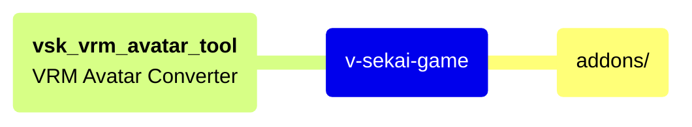
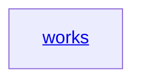

```mermaid
flowchart LR
    A[v-sekai-game] --> B(addons/)
    B --> addon0[**xr_vignette**<hr>Experimental camera tunnel shader to reduce motion sickness]
    B --> addon4[**vsk_map**<hr>Class definitions for game Maps]
    B --> addon5[**splerger**<hr>Mesh splitting with 3d grid for Map culling or pre-upload transform]
    B --> addon6[**state_machine**<hr>Base class for state machines]
    B --> addon8[**gd_util**<hr>Generic utility functions for 3d transforms, camera]
    B --> VRM
    VRM --> addon10[**vrm**<hr>Godot VRM Avatar implementation]
    VRM --> addon11[**Godot-MToon-Shader**<hr>Godot Toon shader for VRM Avatars]
    VRM --> addon1[**vsk_vrm_avatar_tool**<hr>VRM Avatar Converter]
    B --> Misc
    Misc --> addon2[**vsk_version**<hr>Version Strings]
    B --> UI
    UI --> addon3[**vsk_menu**<hr>Main title menus and in-game menus]
    UI --> addon7[**textureRectUrl**<hr>Image preview controls for UI item grids]
    UI --> addon24[**navigation_controller**<hr>Menu state controller (menu switching)]
    UI --> addon15[**emote_theme**<hr>Font files and theme settings]
    B --> Audio
    Audio --> addon14[**kenney_ui_audio**<hr>UI sound sfx .wav library]
    Audio --> addon9[**godot_speech**<hr>Audio packets decoder/encoder]
    B --> addon12[**smoothing**<hr>Fixed timestep interpolation addon for framerate independent physics]
    B --> addon13[**spatial_game_viewport_manager**<hr>Manages viewport size changes]
    B --> addon16[**background_loader**<hr>Interface for resource load requests with whitelist]
    B --> addon17[**extended_kinematic_body**<hr>Improved CharacterBody3d with better tolerance for stairs/slopes]
    B --> addon18[**sar1_mocap_manager**<hr>Motion capture reading/recording in a custom format]
    B --> addon19[**sar1_screenshot_manager**<hr>Utility to capture screenshots]
    B --> addon20[**sar1_vr_manager**<hr>Main VR Controller. Manages HMD settings, trackers, render tree.]
    addon20 --> dir0[**components**<hr>Lasso, Teleport, Hand Pose, Locomotion functions]
    B --> addon21[**input_manager**<hr>Input device setup for Joypad/Mouse]
    B --> addon22[**line_renderer**<hr>Experimental line render for 3d pen writing function]
    B --> addon23[**math_util**<hr>Utility math functions]
    B --> addon25[**xr_vignette/**<hr>test]
    B --> addon26[**xr_vignette/**<hr>test]
    B --> addon27[**xr_vignette/**<hr>test]
    B --> addon28[**xr_vignette/**<hr>test]
    B --> addon29[**xr_vignette/**<hr>test]
    B --> addon30[**xr_vignette/**<hr>test]
    B --> addon31[**xr_vignette/**<hr>test]
    B --> addon32[**xr_vignette/**<hr>test]
    B --> addon33[**xr_vignette/**<hr>test]
```





    subgraph one
        C --> D[Keep]
    end
    C --> E[Edit Definition]
    E --> B
    D --> F[Save Image and Code]
    F --> B

<a id='test'>works</a>
