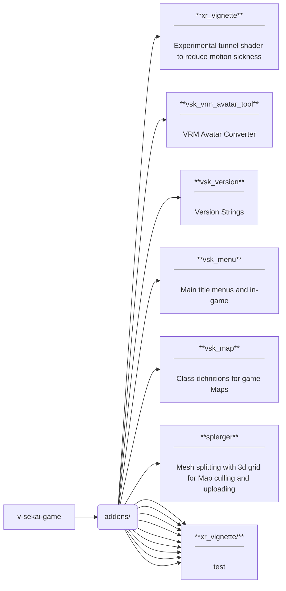
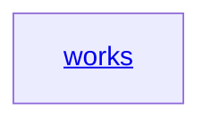

```mermaid
flowchart LR
    A[v-sekai-game] --> B(addons/)
    B --> addon0[**xr_vignette**<hr></br>Experimental tunnel shader to reduce motion sickness]
    B --> addon1[**vsk_vrm_avatar_tool**<hr></br>VRM Avatar Converter]
    B --> addon2[**vsk_version**<hr></br>Version Strings]
    B --> addon3[**vsk_menu**<hr></br>Main title menus and in-game]
    B --> addon4[**vsk_map**<hr></br>Class definitions for game Maps]
    B --> addon5[**splerger**<hr></br>Mesh splitting with 3d grid for Map culling and uploading]
    B --> addon[**xr_vignette/**<hr></br>test]
    B --> addon[**xr_vignette/**<hr></br>test]
    B --> addon[**xr_vignette/**<hr></br>test]
    B --> addon[**xr_vignette/**<hr></br>test]
    B --> addon[**xr_vignette/**<hr></br>test]
    B --> addon[**xr_vignette/**<hr></br>test]
    B --> addon[**xr_vignette/**<hr></br>test]
    B --> addon[**xr_vignette/**<hr></br>test]
    B --> addon[**xr_vignette/**<hr></br>test]

```

```mermaid
flowchart TB
  A[<a href='https://github.com/dragonhunt02/v-sekai-game/blob/docs/codebase.md#test'>works</a>]
```
    subgraph one
        C --> D[Keep]
    end
    C --> E[Edit Definition]
    E --> B
    D --> F[Save Image and Code]
    F --> B

<a id='test'>works</a>
